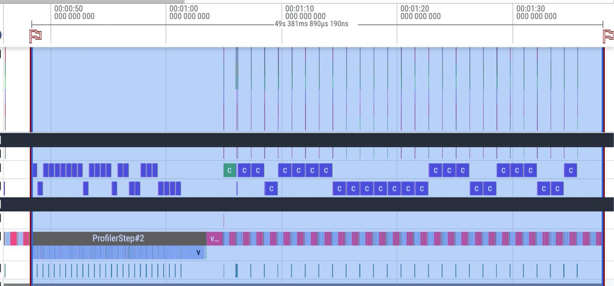
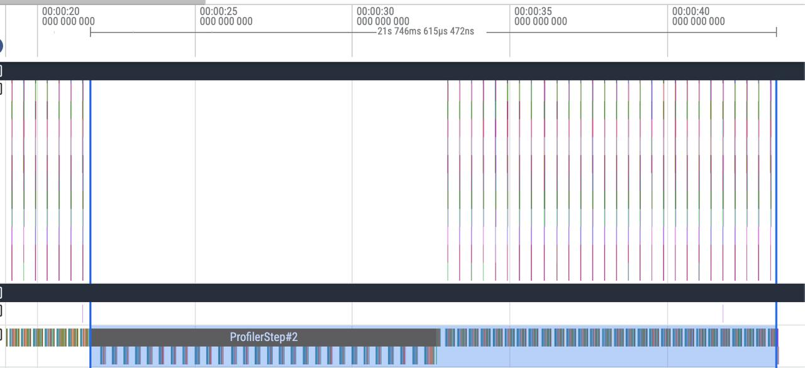
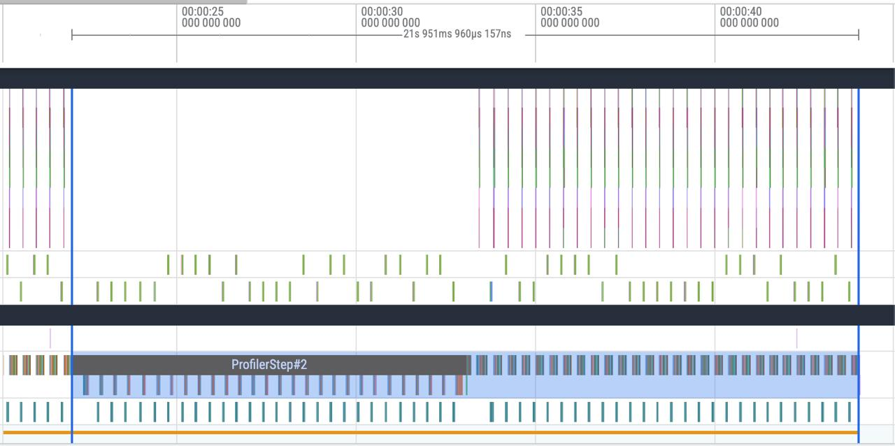
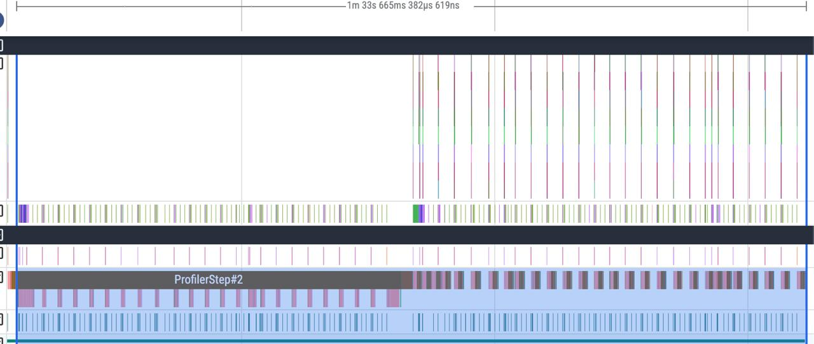
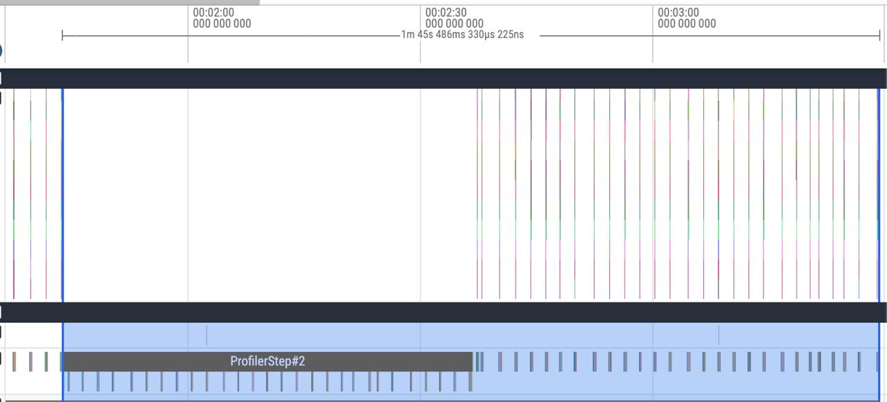
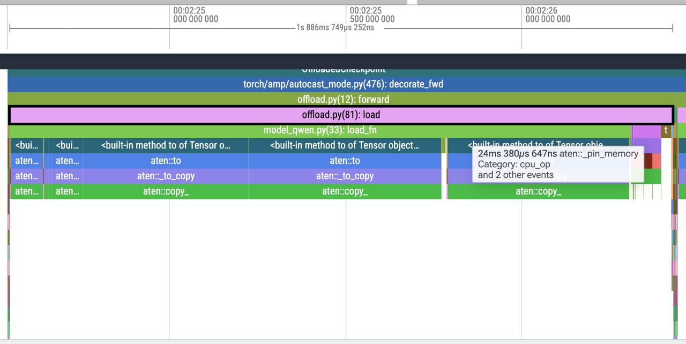
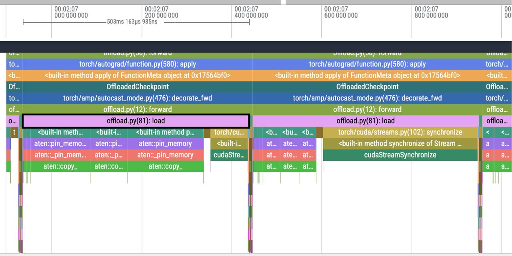

# Extreme Offloading

**"From bf16 to fp16 and back."** I start with bf16 on Kaggle T4. Optimize transfer — pinning, prefetch, CUDA streams. Hit a correctness bug that almost passed for a precision issue. bf16 on T4 has no tensor cores — everything is emulated in fp32. I switch to fp16 to unlock them. The model runs 2.5x faster, but most of the transfer optimizations become useless. Prefetch makes things worse. Why? I move to Colab to test whether the OS cache is responsible. There a new surprise — fp16 becomes slower than bf16 despite tensor cores. But all these destinations are less interesting than what I figured out along the way. More on that below!

## Introduction 
I wanted to train a 7B model in 7GB VRAM without quantization — just to see what I can squeeze out of layer-wise offloading. The code ended up being ~200 lines. The interesting part was everything around it: each optimization I added worked until I changed one variable — dtype, hardware, environment — and then it broke or made things worse. This post is about that process.

The optimizations here don't produce dramatic speedups — the bottlenecks are too extreme for that. The value of this project is in the analysis: understanding why each optimization helps or doesn't, debugging timing-dependent correctness issues, and making sense of counterintuitive profiler traces.

Some of the questions I investigated:
- How to maximize memory transfer speed? Should I always pin?
- Why might prefetch be slower than no prefetch?
- Why might fp16 end up slower than bf16 despite using tensor cores?
- Why does training loss diverge only in bf16, and only with prefetch enabled?

Key observations:
- GPU utilization ≠ performance: fp16 with tensor cores shows lower utilization but is 2.5x faster than bf16 with nearly full utilization.
- Extreme bottlenecks resist micro-optimizations.
- The OS is part of your system. Page cache behavior, readahead heuristics, mmap access patterns — invisible in traces but likely responsible for some of the weird behavior.
- Whether pinning helps depends on the hardware.
- One must be careful with custom CUDA streams and the caching allocator.
- A bug that's invisible at one speed becomes catastrophic at another.

## 0. Setup

### Safetensors

The whole approach requires loading individual layers from disk. With pickle-based checkpoints you'd typically have to load the entire file to extract one tensor, or pre-split into per-layer files. Safetensors gives random access out of the box — memory-map the file, read any tensor by key:

```python
with safe_open("model.safetensors", framework="pt", device="cpu") as f:
    tensor = f.get_tensor("model.layers.15.self_attn.q_proj.weight")
```

### Meta device

We need the model's architecture without allocating memory. `meta` device creates tensors that know their shape and dtype but occupy zero bytes:

```python
with torch.device("meta"):
    model = AutoModelForCausalLM.from_config(config, dtype=torch.bfloat16)
```

Later, `load_state_dict(..., assign=True)` replaces meta parameters with real tensors. Without `assign=True` PyTorch tries to copy into existing storage — which doesn't exist on meta.

### LoRA stays on GPU

LoRA adapters are a few MB vs multiple GB of base weights. They stay materialized on GPU for the entire run — no offloading. This is the key asymmetry: gradients flow only through LoRA, base weights are read-only context that we stream in and out.

Each layer wrapper is linked into a chain and triggers prefetch of the next one (or previous, in backward) — one layer ahead only, to keep memory usage minimal.

## 1. Kaggle T4, bf16 — compute-bound

### Baseline

The offload cycle is simple: for each layer, load weights from disk → compute → replace weights with meta tensors to free memory. Every layer is loaded twice per step (forward and backward) since we only save activations between passes. This is wrapped in a custom `autograd.Function` so it triggers automatically in both directions.

Baseline without any transfer optimizations: **55s**.

I look at the profiler trace — GPU utilization is near perfect. Almost all time is spent in compute. The transfer is a relatively small fraction. Looks good, but we can still try to hide that transfer.

### Pinning and overlapping transfers

`tensor.to(device)` from pageable CPU memory forces CUDA to internally copy to a pinned staging buffer first, then DMA to GPU. Two copies, no overlap possible.

Whether pinning helps depends on the situation — you'd need to profile. On Kaggle T4, pin + transfer was consistently cheaper than direct pageable transfer:

| Size (MB) | Pageable (GB/s) | Pinned (GB/s) | Pin+To (GB/s) | P vs Page | P+T vs Page |
|----------:|-----------------:|--------------:|---------------:|----------:|------------:|
| 1 | 4.03 | 11.65 | 6.17 | 2.89x | 1.53x |
| 10 | 6.39 | 12.30 | 7.62 | 1.92x | 1.19x |
| 50 | 6.86 | 12.36 | 6.58 | 1.80x | 0.96x |
| 100 | 6.82 | 12.38 | 7.23 | 1.82x | 1.06x |
| 500 | 6.85 | 12.38 | 7.18 | 1.81x | 1.05x |
| 1000 | 7.02 | 12.38 | 7.30 | 1.76x | 1.04x |
| 2000 | 7.02 | 12.38 | 7.20 | 1.76x | 1.03x |

The real win is overlapping pinning with transfers across tensors. Not "pin everything, then send everything" — pin tensor N, start its transfer with `non_blocking=True`, immediately pin tensor N+1 while the GPU is still pulling N:

```python
cache = {k: v.pin_memory().to(device, non_blocking=True) for k, v in cache.items()}
torch.cuda.synchronize()
```

`pin_memory()` blocks CPU but `.to(non_blocking=True)` returns immediately, so while GPU pulls tensor N across PCIe, CPU is already pinning N+1. This roughly halved transfer time compared to the naive sequential approach.

Result: **50.8s**.

### Prefetch in a separate CUDA stream

The transfer is faster now but still synchronous — the GPU waits for weights before computing. Prefetching loads the next layer while the current one computes, using a separate CUDA stream so the transfer doesn't block compute. The pinning work runs in a separate CPU thread since `pin_memory()` is blocking.

```python
with torch.cuda.stream(self._stream):
    self._cache = {k: v.pin_memory().to(self.device, non_blocking=True) for k, v in self._cache.items()}
```

Result: **49.5s**. Transfer is now almost fully hidden behind compute. We've squeezed out what we can — the remaining time is pure computation.

### The `record_stream` bug

At this point I noticed that with prefetch enabled, training loss diverged. Only in bf16. Values weren't NaN — just subtly wrong.

First instinct: T4 emulates bf16 through fp32 on CUDA cores, maybe there's some precision issue, some randomness in the emulation. That would be a reasonable explanation to accept and move on.

But something felt off, so I kept digging. Four hours later: the CUDA caching allocator was reusing memory from the prefetch stream while the compute stream was still reading it.

The mechanism: when you allocate a tensor in stream B and use it in stream A, PyTorch's caching allocator **only knows about stream B**. Once stream B moves on, the allocator considers that memory free — even if stream A is still reading it. Silent data corruption.

Why bf16 specifically? Compute is slow enough (no tensor cores, fp32 emulation) that the prefetch stream completes and its memory gets reclaimed *while* the compute stream is still reading it. In fp16, tensor cores consume data so fast the race never triggers. Same buggy code, no visible corruption.

Fix:

```python
current = torch.cuda.current_stream(self.device)
for v in self._cache.values():
    v.record_stream(current)
```

Tell the allocator these tensors are alive in the compute stream too. Glad I didn't blame precision and move on — this would have bitten me later in ways much harder to debug.

---

## 2. Kaggle T4, fp16 — memory-bound

Now that we know bf16 on T4 is emulated without tensor cores — let's switch to fp16 and actually use them.

Baseline without optimizations: **24.3s**. More than 2x faster. But the profiler trace tells a completely different story.

### Utilization ≠ performance

<p>


<br>
<em>Left: bf16, 49.5s — near-full GPU utilization (CUDA cores). Right: fp16, 21.7s — GPU looks mostly idle but finishes 2.5x faster (tensor cores).</em>
</p>

bf16 showed near-perfect utilization — but it was CUDA cores doing slow fp32-emulated math. fp16 looks half-idle, but tensor cores tear through the actual compute in a fraction of the time. The bottleneck has completely flipped: we're no longer compute-bound, we're waiting for data.

### Prefetch hurts

With pinning: **21.7s**. Add prefetch: **21.9s**. Slower.

<p>


<br>
<em>Left: no prefetch, 21.7s. Right: with prefetch, 21.9s — extra streams and sync overhead visible at the bottom.</em>
</p>

Compute is so fast there's no window to hide the transfer in. Prefetch adds synchronization overhead that costs more than the ~6ms of dispatch time it saves.

Also interesting: the `record_stream` fix from the bf16 scenario is unnecessary here. In fp16, tensor cores consume the data before the allocator can reclaim it. The same race condition exists in the code — it just never triggers.

We optimized, added prefetch, added streams — and the fastest result is without prefetch (but with pinning!). Sometimes less concurrency is more.

### The 17-second anomaly

Some runs without prefetch clocked ~17s — faster than any optimized configuration. My best explanation: without concurrent CUDA dispatch and background threads, the OS sees a cleaner sequential read pattern on the safetensors file and its page cache prefetches more aggressively. Adding concurrency fragments the access pattern and increases syscall overhead. Not fully confirmed, but the correlation was clear.

This made me curious about a different environment where OS caching behaves differently. That is why I moved to Colab ...

---

## 3. Colab — disk-bound

On Colab the disk is slower and the OS page cache is less effective (different virtualization, less RAM for caching). This changes the picture.

### bf16

Pinning: **1m 38.7s**. With prefetch: **1m 33.5s**.

On Colab disk read dominates almost entirely. But it was interesting to find that the backward pass (on bf16!) benefits *more* — it has *maximum* compute per layer, so prefetch can hide pin+transfer behind compute (~5s improvement).

All the optimizations work here — pinning helps, prefetch helps. The environment matters.

### Tensor cores ≠ faster

Then I switch to fp16, expecting an improvement. Pinning: **1m 45.8s**. *Slower* than bf16.

<p>


<br>
<em>Left: bf16, 1m 33.5s. Right: fp16, 1m 45.8s — slower despite tensor cores.</em>
</p>

This is the result I'm least certain about, but here's what the profiler traces suggest.

The safetensors checkpoint stores weights in bf16. Loading as bf16 is essentially a no-op — data goes straight from mmap into the pinning buffer. Loading as fp16 triggers an actual dtype conversion on CPU: new allocation, element-wise copy.

<p>


<br>
<em>Left: bf16 load — time spent in pin_memory(), with occasional fast 24ms pins. Right: fp16 load — time spent in dtype cast, followed by cudaStreamSynchronize.</em>
</p>

**bf16:** load time is mostly `pin_memory()`, typically ~1.8s per layer. But a significant number of layers pin in ~0.5s — frequent enough to add up to a ~7s advantage over the full model.

**fp16:** the dtype cast dominates, also landing around ~1.8s total per layer. Pinning after the cast is near-instant (~20ms) — the freshly allocated memory is trivial to pin. But the fast ~0.5s loads that bf16 benefits from almost never occur in fp16.

Why bf16 occasionally pins so quickly — whether it's reusing previously pinned memory, better OS page cache behavior, or something else — I didn't establish. The cast in fp16 likely prevents whatever mechanism is responsible, possibly by forcing a fresh allocation every time.

I planned to verify by pre-casting the checkpoint to fp16, but ran out of Colab compute. Treat this as a plausible hypothesis.

---

## Summary

| Scenario | Environment | dtype | Baseline | + Pinning | + Prefetch | Notes |
|----------|------------|-------|----------|-----------|------------|-------|
| Compute-bound | Kaggle T4 | bf16 | 55.0s | 50.8s | 49.5s | No tensor cores, fp32 emulation |
| Memory-bound | Kaggle T4 | fp16 | 24.3s | 21.7s | 21.9s | Prefetch *hurts* — sync overhead |
| Disk-bound | Colab | bf16 | — | 1m 38.7s | 1m 33.5s | Slower disk, no OS cache benefit |
| Disk + cast | Colab | fp16 | — | 1m 45.8s | 1m 40.0s | Slower than bf16 — cast overhead |

Nothing here is universal. Pinning helps on Kaggle but not always on Colab. Prefetch helps when compute-bound but hurts when memory-bound. Tensor cores help on Kaggle but make things worse on Colab because of cast overhead. The only significant speedup is switching from bf16 to fp16 on Kaggle. Everything else is single-digit percentages — technically interesting but minor in absolute terms.
